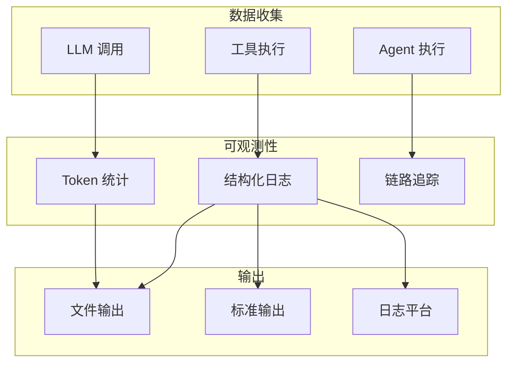
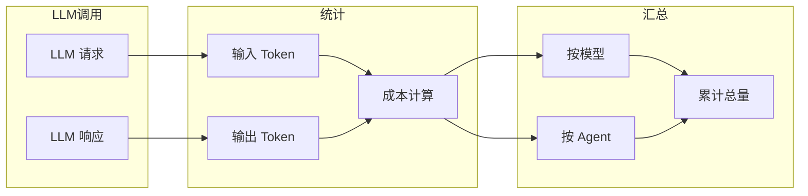
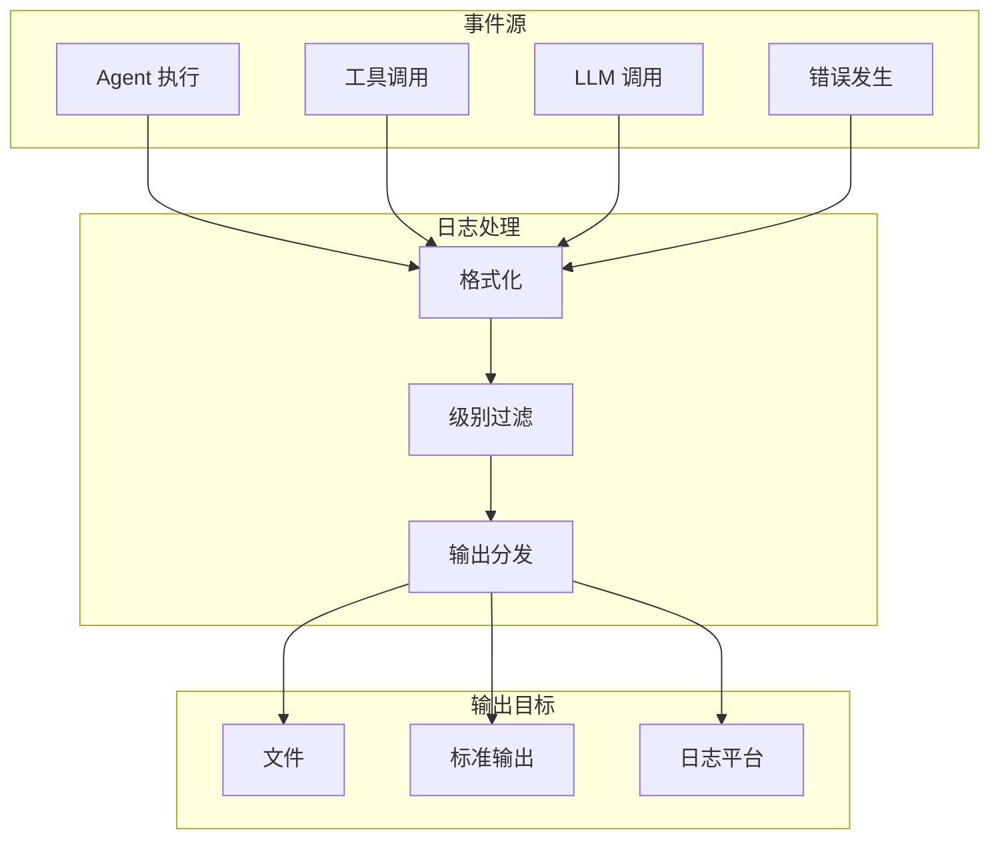
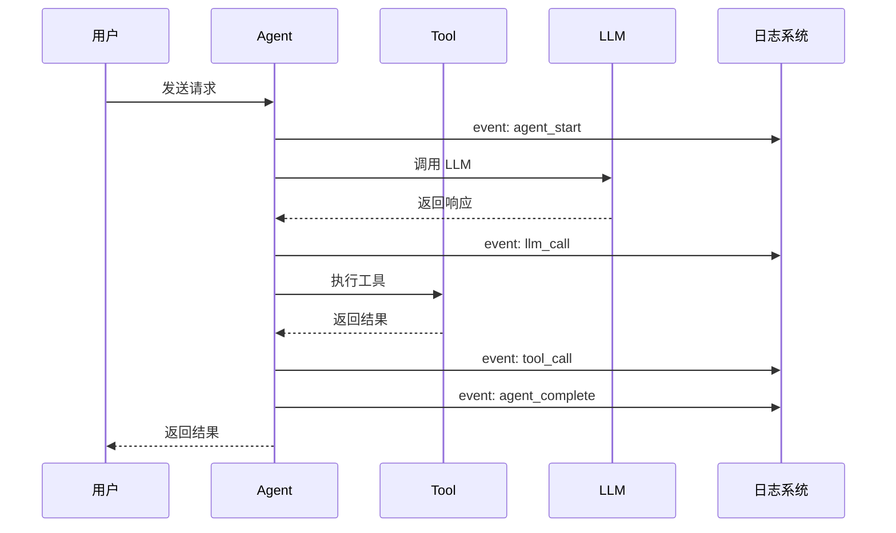

# 可观测性

GoReAct 提供完整的可观测性支持，包括 Token 用量统计和结构化日志输出。

## 架构概览



## 配置可观测性

在 `goreact.yaml` 中配置：

```yaml
observability:
  enabled: true
  
  logging:
    level: info              # 日志级别：debug, info, warn, error
    format: json             # 日志格式：json, text
    outputs:
      - type: file
        path: ./logs/app.log
        max_size: 100        # 单文件最大 MB
        max_backups: 5       # 保留文件数
        max_age: 30          # 保留天数
        compress: true       # 是否压缩
  
  token:
    enabled: true
    pricing:
      gpt-4:
        input_price: 0.03    # 每 1K tokens
        output_price: 0.06
        currency: USD
    export_path: ./logs/tokens.json
```

## Token 用量统计

### 功能说明

Token 用量统计模块自动记录每次 LLM 调用：



- **输入 Token 数**：发送给模型的 Token 数量
- **输出 Token 数**：模型返回的 Token 数量
- **成本计算**：根据配置的单价计算费用
- **累计统计**：按模型、按时间汇总用量

### 配置定价

```yaml
observability:
  token:
    enabled: true
    pricing:
      gpt-4:
        input_price: 0.03    # $0.03 / 1K tokens
        output_price: 0.06   # $0.06 / 1K tokens
        currency: USD
      gpt-35-turbo:
        input_price: 0.0015
        output_price: 0.002
        currency: USD
      claude-3:
        input_price: 0.015
        output_price: 0.075
        currency: USD
```

### 导出用量报告

Token 用量会自动导出到指定文件：

```json
{
  "summary": {
    "total_input_tokens": 15000,
    "total_output_tokens": 8000,
    "total_cost": 0.93,
    "currency": "USD"
  },
  "by_model": {
    "gpt-4": {
      "input_tokens": 10000,
      "output_tokens": 5000,
      "cost": 0.60
    },
    "claude-3": {
      "input_tokens": 5000,
      "output_tokens": 3000,
      "cost": 0.33
    }
  },
  "by_agent": {
    "researcher": {
      "input_tokens": 8000,
      "output_tokens": 4000,
      "cost": 0.48
    },
    "writer": {
      "input_tokens": 7000,
      "output_tokens": 4000,
      "cost": 0.45
    }
  },
  "records": [
    {
      "timestamp": "2024-01-15T10:30:00Z",
      "agent": "researcher",
      "model": "gpt-4",
      "input_tokens": 500,
      "output_tokens": 300,
      "cost": 0.033
    }
  ]
}
```

## 结构化日志

### 日志流程



### 日志级别

| 级别    | 说明                         |
| ------- | ---------------------------- |
| `debug` | 调试信息，包含详细的执行过程 |
| `info`  | 常规信息，记录关键操作       |
| `warn`  | 警告信息，潜在问题           |
| `error` | 错误信息，执行失败           |

### 日志格式

#### JSON 格式

```json
{
  "timestamp": "2024-01-15T10:30:00.000Z",
  "level": "info",
  "agent": "researcher",
  "skill": "web-search",
  "tool": "read",
  "message": "Tool execution completed",
  "duration_ms": 150,
  "metadata": {
    "file": "config.yaml",
    "lines": 50
  }
}
```

#### Text 格式

```
2024-01-15T10:30:00.000Z [INFO] [researcher] [web-search] Tool execution completed duration=150ms file=config.yaml lines=50
```

### 日志输出

支持多种输出方式：

```yaml
observability:
  logging:
    outputs:
      - type: file
        path: ./logs/app.log
        max_size: 100
        max_backups: 5
        max_age: 30
        compress: true
      - type: stdout
```

### 日志轮转

文件输出支持自动轮转：

| 配置项        | 说明                       |
| ------------- | -------------------------- |
| `max_size`    | 单个日志文件最大大小（MB） |
| `max_backups` | 保留的历史文件数量         |
| `max_age`     | 历史文件保留天数           |
| `compress`    | 是否压缩历史文件           |

## 监控关键事件

GoReAct 自动记录以下关键事件：

### 事件流程



### Agent 执行

```json
{
  "event": "agent_start",
  "agent": "researcher",
  "task": "搜索最新的 AI 新闻"
}
```

```json
{
  "event": "agent_complete",
  "agent": "researcher",
  "duration_ms": 5000,
  "success": true
}
```

### 工具调用

```json
{
  "event": "tool_call",
  "agent": "researcher",
  "tool": "web-search",
  "params": ["AI news 2024"],
  "duration_ms": 1200
}
```

### LLM 调用

```json
{
  "event": "llm_call",
  "agent": "researcher",
  "model": "gpt-4",
  "input_tokens": 500,
  "output_tokens": 300,
  "duration_ms": 2500
}
```

### 错误记录

```json
{
  "event": "error",
  "agent": "researcher",
  "error": "timeout",
  "message": "Tool execution timed out after 30s",
  "stack_trace": "..."
}
```

## 生产环境建议

### 1. 合理的日志级别

```yaml
observability:
  logging:
    level: info  # 生产环境使用 info
```

开发环境可以使用 `debug` 获取更多信息。

### 2. 日志轮转配置

```yaml
observability:
  logging:
    outputs:
      - type: file
        path: /var/log/goreact/app.log
        max_size: 100
        max_backups: 10
        max_age: 30
        compress: true
```

### 3. Token 成本监控

定期检查 Token 用量报告，设置预算告警：

```yaml
observability:
  token:
    enabled: true
    budget_alert:
      daily_limit: 10.0    # 每日预算 $10
      monthly_limit: 200.0 # 每月预算 $200
```

### 4. 集成日志平台

JSON 格式日志可直接导入 ELK、Loki 等日志平台：

```yaml
observability:
  logging:
    format: json
    outputs:
      - type: file
        path: ./logs/app.log
```

## 调试技巧

### 查看思考过程

设置 `debug` 级别查看 LLM 的完整思考过程：

```yaml
observability:
  logging:
    level: debug
```

日志将包含：

```json
{
  "event": "llm_thinking",
  "agent": "researcher",
  "thought": "用户想了解最新的 AI 新闻，我需要先搜索相关信息..."
}
```

### 追踪执行链路

通过 `trace_id` 追踪完整的执行链路：

```json
{
  "trace_id": "abc123",
  "event": "agent_start",
  "agent": "orchestrator"
}
```

```json
{
  "trace_id": "abc123",
  "event": "agent_start",
  "agent": "researcher",
  "parent_agent": "orchestrator"
}
```

### 性能分析

日志中的 `duration_ms` 字段可用于性能分析：

```json
{
  "event": "tool_call",
  "tool": "web-search",
  "duration_ms": 2500
}
```

## 下一步

- [配置指南](configuration.md) - 完整的配置选项
- [扩展：Tools](extending/tools.md) - 开发自定义工具
- [扩展：Skills](extending/skills.md) - 编写工作流程
