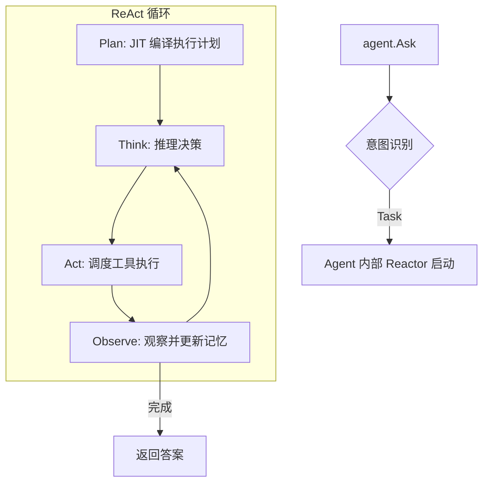

# 快速开始

5 分钟上手 GoReAct，从安装到运行你的第一个智能体应用。

## 安装

```bash
go get github.com/DotNetAge/goreact
```

## 核心设计哲学

GoReAct 提倡**“配置优先来源于环境变量”**与**“开发者完全掌控资源生命周期”**。

框架运行的必要前置条件是初始化依赖系统，尤其是 GraphRAG 所需的图数据库、向量数据库和文档知识库路径。这些配置通常作为环境变量提供：

```bash
export OPENAI_API_KEY="your-api-key"
export GOREACT_DB_PATH="./data/memory"           # Memory 图数据库/向量库路径
export GOREACT_DOCUMENT_PATH="./docs"            # 供 GoRAG 自动索引永久记忆的目录
```

## 最简示例

推荐的做法是将 Agent 与模型定义做成独立的配置文件，而由开发人员在代码中显式注册资源。

### 1. 创建 Agent 配置文件 `agents.yml`

```yaml
agents:
  - name: assistant
    domain: general
    description: 一个友好的助手
    model: gpt-4
```

### 2. 编写 `main.go`

```go
package main

import (
    "github.com/DotNetAge/goreact"
    "my-app/tools"
)

func main() {
    // 1. 初始化引擎，自动读取 GOREACT_DB_PATH 等环境变量
    engine := goreact.NewEngine()
    
    // 2. 资源注册（由开发人员组织）
    // 内置 Tools 已默认注册，这里可以追加自定义工具
    engine.RegisterTools(&tools.MyCustomTool{})
    
    // 加载外部业务配置（支持多个 yml 或从数据库加载）
    engine.LoadAgents("config/agents.yml")
    // engine.LoadModels("config/models.yml")
    
    // 从目录递归加载技能指南 (SKILL.md)
    engine.LoadSkillsFromDir("./skills")
    
    // 3. 启动服务
    // 此过程会触发 GoRAG 对 GOREACT_DOCUMENT_PATH 目录的自动同步索引
    engine.Start()
}
```

## goreact 包核心 API

### 引擎控制

| 函数 | 说明 |
| :--- | :--- |
| `NewEngine()` | 初始化引擎实例，加载环境配置 |
| `engine.Start()` | 启动 ReAct 循环监听与底层 GraphRAG 索引逻辑 |
| `engine.GetAgent(name)` | 从资源管理器获取已注册的 Agent 实例 |

### 资源管理器 (ResourceManager)

`ResourceManager` 提供了全局属性持有，方便开发人员将配置适配于应用界面或动态中心：

- `RegisterTools(...Tool)`: 注册原子执行单元。
- `LoadAgents(path)`: 从 YAML 加载智能体定义。
- `LoadModels(path)`: 从 YAML 加载 LLM 配置。
- `LoadSkillsFromDir(dir)`: 扫描并加载技能 Markdown 目录。

## 内部流程

了解 `engine.Start()` 背后发生了什么：

### 启动流程

```mermaid
flowchart TB
    Start[engine.Start] --> CheckEnv[读取环境变量<br/>DB_PATH/DOC_PATH]
    
    CheckEnv --> InitMem[初始化 Memory<br/>图数据库与向量库]
    
    InitMem --> RAGSync[GraphRAG 自动索引<br/>构建 DocumentPath 永久记忆]
    
    RAGSync --> IndexRes[资源索引与缝合<br/>(Agents/Models/Skills/Tools)]
    
    IndexRes --> Ready[服务就绪]
```

### 执行流程 (Ask 方法)

Agent 是开发者交互的唯一入口，通过 `Ask` 方法开启思考过程：



## 暂停与恢复 (Human-in-the-loop)

当工具涉及敏感操作（如 `LevelHighRisk`）且未在白名单时，流程会自动暂停：

```go
result, err := agent.Ask(ctx, "请删除 temp 目录")

if result.Status == goreact.StatusPending {
    // 界面层展示问题给用户
    fmt.Printf("需要确认: %s\n", result.PendingQuestion.Question)
    
    // 恢复执行（支持一次性允许或加入白名单）
    result, err = agent.Resume(ctx, result.SessionName, "yes")
}
```

## 下一步

- [配置指南](configuration.md) - 深入了解环境变量与资源文件格式
- [扩展工具](extending/tools.md) - 开发你自己的原子 Tool
- [编写技能](extending/skills.md) - 用 Markdown 定义复杂 SOP
