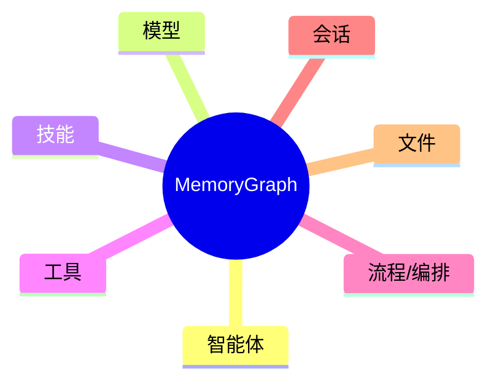
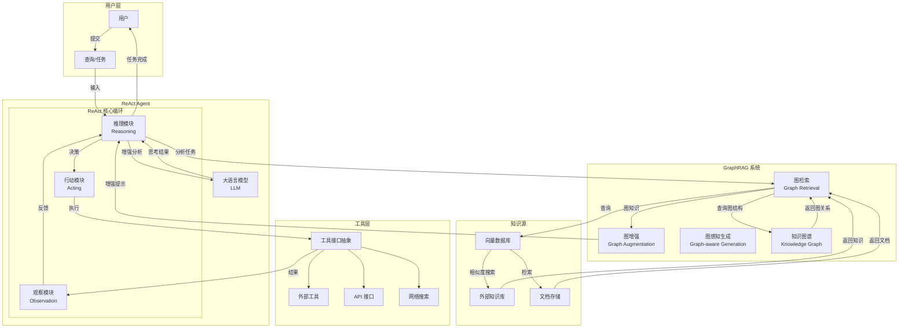
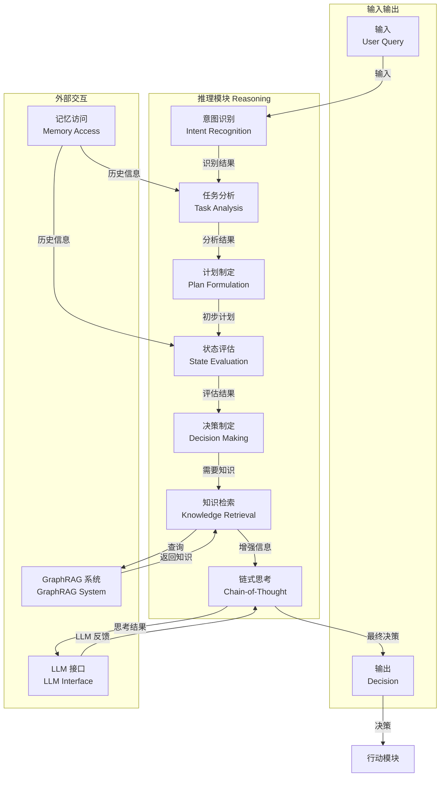
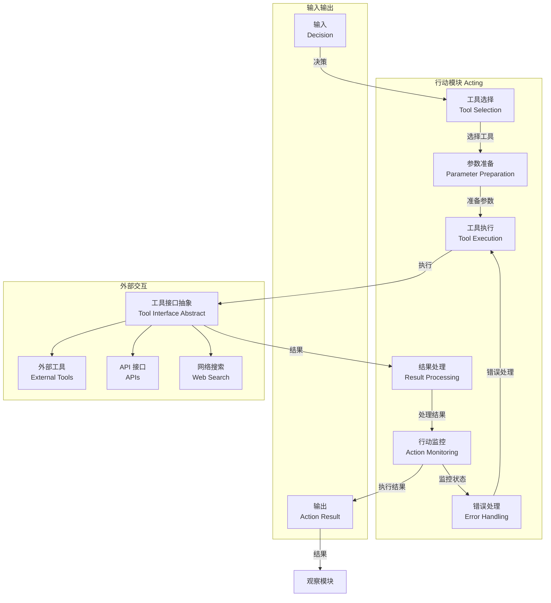
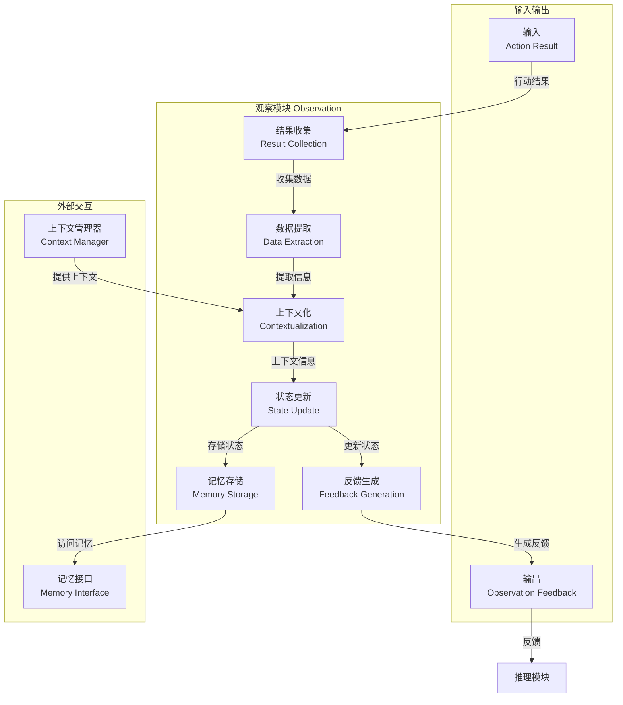

# 概述

GoReAct 是一个基于Go开发的智能体编排框架，它提供了一个统一的接口，用于创建、管理、协调和监控智能体的运行。

GoReAct 的多Agent编排模式与Microsoft AutoGen 类似，是属于中心化调度模式（Orchestration），由一个主Agent进行协调多个子Agent的运行，实现复杂任务的完成。

## 基本概念

- **智能体**(Agent) - 与用户交互的入口，它定义了智能体的专业领域，与特定模型的组合，内置ReAct流程进行思考、执行与自省；
- **模型**(Model) - 定义了LLM调用的基本配置，同样的智能体采用不同模型配置会产生不一样的效果；
- **记忆**(Memory) - 用于存储智能体的思考结果、历史交互记录等，帮助智能体进行自省和学习；
- **工具**(Tool) - 用于执行智能体的任务，如调用外部API、处理数据等；
- **技能**(Skill) - 定义了智能体执行复杂任务的逻辑与流程，对于智能体而言就是一本工作指南；
- **流程/编排**(Workflow/Orchestration) - 用于协调多个智能体的运行，实现复杂任务的完成；

### 资源化 (Resourceization)

“GoReAct 与其它框架的不同点在于强调”自进化“，将一切可定义的内容看作一种资源也就是资源化的概念则是自动化概念实现的前提基础。

GoReAct 将 智能体，模型，技能，工具都视作一种资源，资源具体相同的一些特质：

- 可被定义(Defined)
- 可被发现(Discovered)
- 可被优化(Optimized)
- 可被组合(Composed)

所有的资源对于Agent而言都是具有“渐进式披露”特点，每个Agent无需要知道系统中所有资源，Agent 只需要知道自己需要什么资源，然后通过系统自动发现，并自动组合得到最合适的资源组合。

例如：如果需要多个Agent协同工作时，如果没有所需要的专业领域的Agent，Agent可从Agent库中发现或“创建”一个专业领域的Agent，同理没有流程就创建或发现一个SKill，没有工具就去工具库中“发现”一个工具。

### 记忆图谱 (Memory Graph)

GoReAct 最大的创新在于它采用的“记忆图谱”（Memory Graph）技术。记忆图谱就是模仿人类的“记忆图谱”，将智能体的思考过程、历史交互记录等存储在一个图结构中，帮助智能体进行自省和学习。

简言之:

> 记忆图谱就是智能体用于存储一切知识的数据库

记忆图谱是基于GraphRAG(GoRAG框架中的图RAG模式)实现的，GoReAct将加载过的资源，会话，记忆，流程编排步骤等所有加载过的内容都作为节点存入 GraphDB 之中，形成Agent的总记忆体。当Agent进行推理查询MemoryGraph时就可以像人记忆系统一样搜索相关的知识点。

记忆图谱之中包括：

### 动态图式执行 (Dynamic Graph Execution)

GoReAct 采用前沿的动态图执行技术来实现工作流转逻辑。GoReAct 的设计逻辑是将 Skill 当作一本“操作指南”，Reactor 就像人一样，先“阅读” Skill，并将其操作过程编译为对应的参数化图结构执行计划（Execution Plan）。

> 这就像是将 Skill 作为一份源代码，图结构执行计划则是编译后的可执行程序，由 Reactor 负责加载与调度。

得益于 Memory Graph，Reactor 可以将参考资源与“理解”后的知识经验一并存入记忆之中，随时调阅。当执行计划被触发时，Reactor 会按照预定义的逻辑步进，并结合实时观察（Observation）进行动态调整（如重规划）。

这种基于 ReAct 的执行逻辑使得思考与处理变得更准确，运用 ReAct 的持续观测与改进逻辑可以进一步优化图路径的执行效率（例如：对每一种 Skill 的路径进行量化评分，选择最合适的路径）。

> 简言之：GoReAct 的工作流执行完全集成在 Reactor 引擎中，并基于 Memory Graph 进行驱动。

### ReAct

ReAct（Reasoning and Acting）是‍“推理与行动”‍的合写，是一种用于构建具备强推理能力和主动搜索能力的智能体（Agent）的技术框架。它的核心理念是：当模型面对复杂任务时，不应仅凭“直觉”一次性输出答案，而应像人类一样，一边思考（Reasoning）一边行动（Acting）‍，通过循环迭代的方式逐步逼近正确答案。

以下是对 ReAct 的核心概念及其运作机制的详细解析：

#### 推理（Reasoning）‍

这是指模型的内部思考过程。在每一步中，模型会对当前的观察（Observation）和记忆（Memory）进行分析，生成一个中间的思考链（Chain-of-Thought），它是通往答案的逻辑路径。

> 作用：帮助模型明确下一步要做什么，而不是盲目地直接给出答案。

#### 行动（Acting）‍

这是指模型在推理结束后执行的具体操作。在 ReAct 框架中，常见的行动包括：

- 搜索网络（Search the Internet）
- 查询数据库
- 计算数学公式
- 使用工具（Tool）‍（如绘图、翻译等）

> 作用：让模型能够主动获取外部信息，而不是仅依赖内部训练数据。

#### 运作机制

> 循环的“思考-行动”过程
ReAct 通过一个循环（Loop）‍来完成任务，每一轮包括以下步骤：

- 观察（Observation）‍：当前轮次模型所看到的信息（如任务描述、前一轮的搜索结果等）。
- 思考（Reasoning）‍：基于观察，模型推断下一步该怎么做。
- 行动（Acting）‍：模型执行一个具体的操作（如发起搜索请求）。
- 结果（Result）‍：外部工具返回的数据，作为下一轮的观察。

这一过程不断迭代，直到模型产生最终答案。

## 架构简图

## 推理模块工作原理

### 推理模块的核心组件：

1. **意图识别（Intent Recognition）**
   - 分析用户输入，识别用户的真实意图
   - 区分不同类型的任务（问答、指令、信息查询等）
   - 为后续处理提供方向

2. **任务分析（Task Analysis）**
   - 分解复杂任务为可管理的子任务
   - 识别任务所需的信息和资源
   - 结合历史信息评估任务复杂度

3. **计划制定（Plan Formulation）**
   - 基于任务分析结果制定执行计划
   - 确定步骤顺序和优先级
   - 预估所需的工具和知识

4. **状态评估（State Evaluation）**
   - 评估当前任务进展状态
   - 分析已获取的信息是否足够
   - 确定是否需要调整计划

5. **决策制定（Decision Making）**
   - 决定下一步行动：检索知识、执行工具或直接回答
   - 选择最合适的工具和知识源
   - 评估行动的风险和收益

6. **知识检索（Knowledge Retrieval）**
   - 根据任务需求从GraphRAG系统检索相关知识
   - 整合和过滤检索到的信息
   - 为链式思考提供增强的上下文信息

7. **链式思考（Chain-of-Thought）**
   - 基于检索到的知识进行深度逻辑推理
   - 生成连贯的思考过程
   - 与LLM交互获取推理支持

#### 工作流程：
1. 用户输入进入意图识别
2. 识别结果传递给任务分析
3. 分析结果用于制定计划
4. 计划经过状态评估
5. 评估结果指导决策制定
6. 决策制定判断是否需要知识
7. 需要知识时调用知识检索
8. 知识检索从GraphRAG系统获取相关信息
9. 检索结果增强链式思考
10. 链式思考与LLM交互获取反馈
11. 最终决策输出到行动模块

#### 外部交互：
- **LLM接口**：利用大语言模型的推理能力增强思考过程
- **记忆访问**：获取历史交互和上下文信息，辅助任务分析和状态评估
- **GraphRAG系统**：提供结构化的知识检索和图关系信息，增强推理的准确性

这个图表展示了推理模块如何系统性地处理用户请求，从意图识别到最终决策的完整过程，体现了ReAct框架中"思考"环节的具体实现。

### 文献参考

#### ReAct 框架论文
- **论文标题**：ReAct: Synergizing Reasoning and Acting in Language Models
- **发表会议**：ICLR 2023
- **官方链接**：https://arxiv.org/abs/2210.03629
- **PDF 下载**：https://arxiv.org/pdf/2210.03629.pdf
- **项目主页**：https://react-lm.github.io

#### 链式思考（Chain-of-Thought）论文
- **论文标题**：Chain-of-Thought Prompting Elicits Reasoning in Large Language Models
- **发表会议**：NeurIPS 2022
- **官方链接**：https://arxiv.org/abs/2201.11903
- **PDF 下载**：https://arxiv.org/pdf/2201.11903.pdf
- **Google Research 博客**：https://research.google/blog/language-models-perform-reasoning-via-chain-of-thought/

#### 相关理论参考
- **AI 规划系统**：《Artificial Intelligence: A Modern Approach》（Stuart Russell 和 Peter Norvig）
  - 提供了关于计划制定和决策理论的基础框架
- **意图识别**：相关研究可参考 ACL、EMNLP 等会议的相关论文
- **任务分析**：参考自然语言处理和对话系统领域的相关研究

这些论文和资源为推理模块的设计提供了坚实的理论基础，确保了图表中的工作流程和组件划分符合当前 AI 领域的最佳实践。

### 行动模块工作原理

### 行动模块的核心组件：

1. **工具选择（Tool Selection）**
   - 根据推理模块的决策，选择最合适的工具或操作
   - 考虑工具的适用性、可靠性和执行成本
   - 评估工具执行的预期效果

2. **参数准备（Parameter Preparation）**
   - 为工具执行准备必要的参数
   - 从检索到的知识中提取参数值
   - 验证参数的有效性和完整性

3. **工具执行（Tool Execution）**
   - 调用外部工具、API 或执行搜索操作
   - 执行具体的操作步骤
   - 监控执行过程中的状态

4. **结果处理（Result Processing）**
   - 处理工具执行返回的结果
   - 解析和结构化原始输出
   - 提取有价值的信息

5. **行动监控（Action Monitoring）**
   - 监控行动执行状态，确保任务进展
   - 跟踪执行时间和资源使用
   - 识别执行过程中的异常

6. **错误处理（Error Handling）**
   - 处理执行过程中的异常情况
   - 尝试恢复或采取替代方案
   - 记录错误信息供后续分析

#### 工作流程：
1. 推理模块的决策进入工具选择
2. 选择合适的工具后进行参数准备
3. 执行工具操作并监控执行状态
4. 处理工具返回的结果
5. 监控执行过程并处理可能的错误
6. 将处理后的结果输出到观察模块

#### 外部交互：
- **工具接口**：与各种专用工具交互，执行特定任务
- **API 接口**：与外部服务和系统交互
- **搜索接口**：从网络或内部知识库获取信息

### 文献参考

#### ReAct 框架论文
- **论文标题**：ReAct: Synergizing Reasoning and Acting in Language Models
- **发表会议**：ICLR 2023
- **官方链接**：https://arxiv.org/abs/2210.03629

#### 工具使用与执行相关研究
- **论文标题**：Tool Use in Large Language Models
- **发表会议**：NeurIPS 2023
- **相关链接**：https://arxiv.org/abs/2305.10601

#### API 调用与外部交互
- **论文标题**：API-Bank: A Benchmark for Tool-Augmented LLMs
- **发表会议**：ICLR 2024
- **相关链接**：https://arxiv.org/abs/2308.03958

### 观察模块工作原理

### 观察模块的核心组件：

1. **结果收集（Result Collection）**
   - 收集工具执行、API 调用或搜索的结果
   - 聚合来自不同来源的信息
   - 确保所有执行结果都被捕获

2. **数据提取（Data Extraction）**
   - 从原始结果中提取有价值的信息
   - 过滤无关或冗余的数据
   - 识别关键实体和关系

3. **上下文化（Contextualization）**
   - 将提取的信息与当前任务上下文结合
   - 建立信息与任务目标的关联
   - 评估信息的相关性和重要性

4. **状态更新（State Update）**
   - 更新智能体的内部状态
   - 记录任务进展和已获取的信息
   - 维护执行历史和状态轨迹

5. **反馈生成（Feedback Generation）**
   - 生成结构化的反馈信息
   - 格式化信息以适应推理模块的需求
   - 突出关键信息和发现

6. **记忆存储（Memory Storage）**
   - 将重要信息存储到记忆系统中
   - 建立信息的长期记忆
   - 支持未来任务的信息检索

#### 工作流程：
1. 行动模块的执行结果进入结果收集
2. 收集的数据经过提取和过滤
3. 提取的信息与任务上下文结合
4. 更新智能体的内部状态
5. 生成结构化的反馈信息
6. 将重要信息存储到记忆系统
7. 反馈信息输出到推理模块

#### 外部交互：
- **记忆接口**：与长期记忆系统交互，存储和检索信息
- **上下文管理器**：维护和提供任务上下文信息

### 文献参考

#### ReAct 框架论文
- **论文标题**：ReAct: Synergizing Reasoning and Acting in Language Models
- **发表会议**：ICLR 2023
- **官方链接**：https://arxiv.org/abs/2210.03629

#### 观察与反馈相关研究
- **论文标题**：Active Observation and Feedback in Language Agents
- **发表会议**：ICML 2023
- **相关链接**：https://arxiv.org/abs/2302.07810

#### 状态管理与记忆
- **论文标题**：Memory Augmented Language Models for Task-Oriented Dialogue
- **发表会议**：ACL 2023
- **相关链接**：https://arxiv.org/abs/2305.08291
 

## 技术栈

- Go 1.24+
- [GoRAG](https://gorag.rayainfo.cn) - 提供完整的NativeRAG 与 GraphRAG 功能，可直接支持多种的向量数据库与图数据库，内置嵌入式向量数据库与图数据库支持，开箱即用。
- LLM与Embedding框架 - [GoChat](https://gochat.rayainfo.cn) 提供统一的 LLM 接口，支持多种大语言模型，包括 OpenAI、Google、Meta 等。提供了简洁易用的LLM调用方式，所有的LLM调用都可以直接依赖于它而不需要通过其它框架调用。