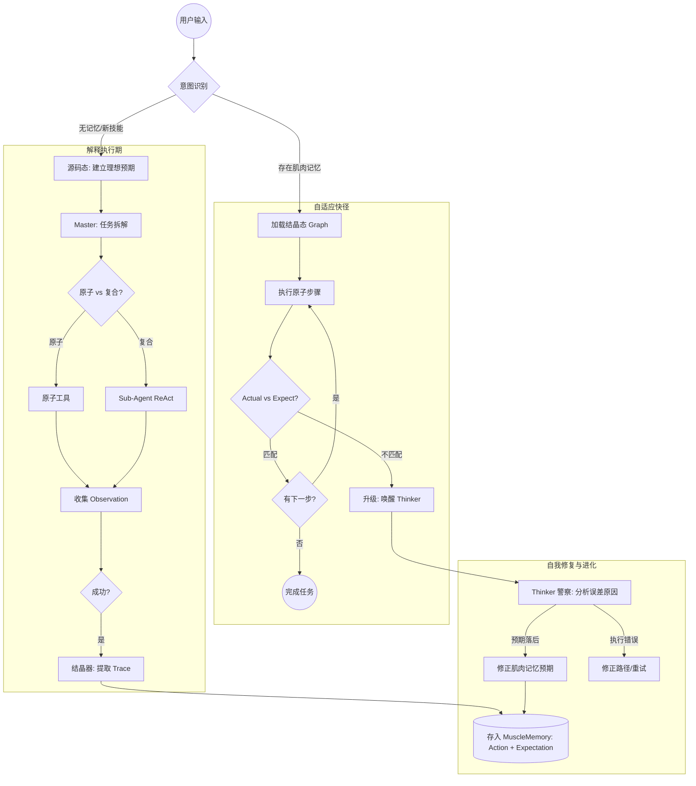

# Skill 系统设计：从“提示词工程”到“智能体编译”

本目录 (`pkg/skill`) 实现了 GoReAct 核心的技能进化与执行引擎。不同于传统的 DAG 工作流或简单的 System Prompt 注入，GoReAct 采用了**“三态转化”**架构，旨在解决复杂任务编排中的 Token 成本、响应延迟与执行确定性问题。

## 1. 核心哲学：技能的三态转化 (The Three States of Skill)

在 GoReAct 中，一个 Skill 不仅仅是一段文字，它是一个从“模糊意图”进化到“确切逻辑”的生命体。

### 状态一：源码态 (The Source - `SKILL.md`)
*   **载体**：由人类编写的 Markdown 标准作业程序 (SOP)。
*   **执行方式**：**解释执行 (Interpretation)**。
*   **核心任务**：**建立理想化预期 (Idealized Expectation)**。
    *   Master-Agent 首次接触 Skill，通过高成本的 LLM 推理（Master-Sub 编排）进行探索。
    *   在首次成功执行后，系统记录全链路 Trace，生成第一份“理想化”的步骤与结果指纹。

### 状态二：结晶态 (The Crystallized - `AST/DAG`)
*   **载体**：存储在 `MemoryBank.Muscle` 中的**结构化执行图 (Execution Graph)**。
*   **特性**：原子化、强结构化，包含每一步的 **预期观察 (Expected Observation)**。
*   **生成方式**：**结晶 (Crystallization)**。
    *   将解释期的成功经验编译为确定的 Action 序列 + 预期指纹。
    *   **本质**：这是技能的“编译产物”，即真正的“肌肉记忆”。

### 状态三：执行态 (The Execution - `Adaptive Fast-Path`)
*   **执行方式**：**自适应快径执行 (Adaptive Execution)**。
    *   优先加载结晶态，绕过 LLM Think 循环。
    *   **判定逻辑**：**实际 (Actual) vs. 预期 (Expect)**。
    *   如果一切如旧（匹配预期），则“短路执行”以极速完成任务。
    *   如果出现偏差（不及预期），则触发“升级机制”。

---

## 2. 肌肉记忆的进化：预期修正与自我修复

肌肉记忆在 GoReAct 中不是僵化的代码，而是一个具备“反馈回路”的进化内核。

### 2.1 升级机制 (Escalation)
当执行态发生偏差时，系统立即挂起线性执行，启动调查与修复机制。核心角色分工如下：
*   **Observer (法官)**：负责**裁定**。它对比实际结果 (Actual) 与预期指纹 (Expectation)。如果发现不匹配，法官敲锤驳回，判定为“不及预期”，并触发升级。
*   **Thinker (警察/侦探)**：被法官唤醒后接手案件。它负责**推理**与调查误差原因：
    1.  **环境变迁**：如果业务逻辑正确但结果指纹变了（如 API 更新），推断为 **“预期落后”**。
    2.  **执行异常**：如果是因为偶发性错误（如网络超时），推断为 **“执行错误”**。

### 2.2 经验更新 (Experience Update)
*   如果是**预期落后**，`Crystallizer` 会利用最新的成功 Trace **修正肌肉记忆中的预期指纹**。
*   这种“对齐误差”的过程，实现了无需模型微调的“逻辑层进化”，使 Agent 越用越精准。

---

## 3. 编排模式：Master 与 Sub-Agent 的协作

### Master-Agent (总控)
*   **职责**：负责全局状态管理、任务拆解判定、子任务分发、以及最终结果的聚合。
*   **决策逻辑**：
    *   **原子判断**：若步骤匹配现有原子 Tool，直接分发。
    *   **复合判断**：若步骤复杂模糊，开启独立的 `Sub-ReAct` 循环进行降维推理。

### Sub-Agent (执行者)
*   **职责**：执行特定的原子任务。
*   **输出**：返回包含结果数据与执行路径的 `TaskResult`，供 Master 进行最终判定与结晶。

---

## 4. 自适应执行流程图 (Mermaid)

---

## 5. 开发路线 (Phase 4 重点)

1.  **数据模型重构**：定义 `CrystallizedGraph`，包含 `Expectation` 校验逻辑。
2.  **实现升级机制**：在 `Reactor` 中增加从线性模式切换到 ReAct 模式的逻辑。
3.  **完善结晶器**：实现从 Trace 中自动提取并泛化“预期指纹”的算法。
4.  **Master-Sub 闭环**：实现子任务 Trace 的回传与 Master 层的最终判定逻辑。
